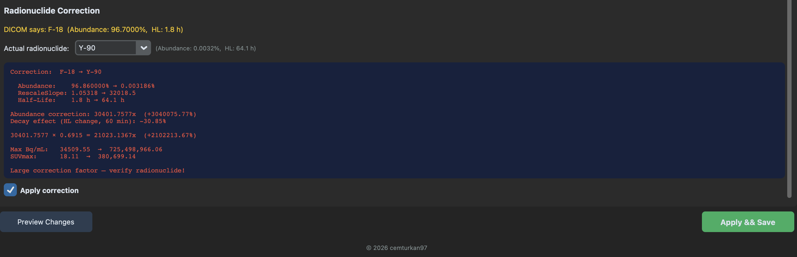
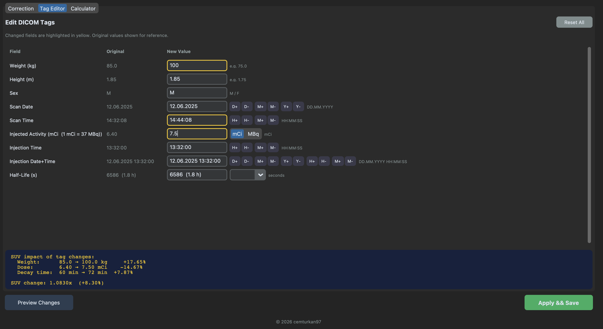
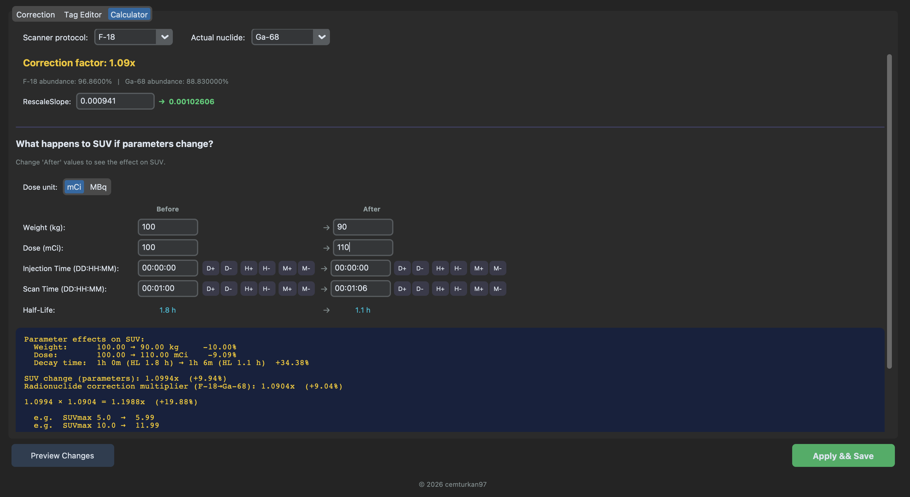

# PET DICOM Fixer

A desktop tool for fixing common data entry errors and mislabeled radionuclides in PET DICOM files.

## Why?

PET DICOM headers are only as accurate as the data entered at the scanner console. In a busy nuclear medicine department, mistakes happen:

- **Wrong patient weight** — the technician enters 70 kg instead of 107 kg
- **Wrong injected dose** — mCi/MBq confusion, or a typo in the value
- **Wrong date or time** — yesterday's date carried over, injection time off by hours
- **Wrong radionuclide** — scanner left on F-18 protocol for a Ga-68 or Y-90 scan

These errors directly affect SUV calculations, dosimetry, and clinical decisions. Fixing them manually requires knowledge of DICOM tag structure. PET DICOM Fixer makes it simple.

## What It Does

### Correction Tab
When the scanner records the wrong radionuclide (e.g. F-18 instead of Y-90), the positron abundance mismatch can be enormous — up to **30,000x**. The tool:
- **Detects the radionuclide** from the half-life stored in DICOM, regardless of the label
- **Corrects RescaleSlope** by the abundance ratio, scaling activity concentration (Bq/mL) to the correct level
- **Updates metadata**: RadionuclideCodeSequence, half-life, positron fraction, radiopharmaceutical name
- **Shows SUV impact**: Displays abundance correction, decay effect from half-life change, and total multiplier with before/after SUVmax values



### Tag Editor
Edit common DICOM fields with a two-column layout (original value read-only, new value editable):
- Patient weight, height, sex
- Injected dose with mCi/MBq toggle (auto-converts on switch)
- Injection time and date+time with stepper buttons (H+/H-/M+/M-/D+/D-/Y+/Y-)
- Scan date and time with stepper buttons
- Half-life with radionuclide preset dropdown (F-18/Ga-68/Y-90/Cu-64)
- **Live SUV impact** display showing per-parameter effects and total change
- Changes are highlighted in yellow and previewed before saving



### Calculator
A standalone tab for exploring how parameter changes affect SUV — no DICOM files needed:
- Before/After columns for comparing weight, dose, timing, and radionuclide
- Time format DD:HH:MM with day/hour/minute stepper buttons
- mCi/MBq unit toggle with automatic conversion
- Shows abundance correction, decay effect, and total multiplier breakdown
- Reset button to restore defaults



### Safety
- Original files are **never modified** — corrected files go to a new `_corrected` folder
- A JSON backup records all original values and applied changes
- Preview dialog shows exactly what will change before saving

## Limitations of Radionuclide Correction

When correcting a mislabeled radionuclide, this tool fixes the abundance scaling and metadata. The corrected values are **significantly closer to reality**. However, the following effects are baked into the reconstructed image by the scanner and cannot be corrected without raw sinogram data:

- **Per-frame decay correction**: Each bed position's decay factor was computed with the wrong half-life. The error grows with the half-life difference and the number of bed positions. For single-bed scans the error is typically <1%. For multi-bed scans, later beds may have up to ~5% error (e.g. F-18 → Ga-68, where the half-life ratio is 1.6x).
- **Positron range**: Different radionuclides produce positrons with different energies, which travel different distances before annihilation. F-18 ~1 mm, Cu-64 ~1 mm, Ga-68 ~3 mm, Y-90 ~5 mm. When the scanner reconstructs with F-18 assumptions, the spatial resolution model is slightly wrong for other radionuclides. The practical impact is small for Ga-68 and negligible for Cu-64.
- **Scatter and prompt emissions**: Annihilation photons are always 511 keV regardless of radionuclide, so scatter correction is largely unaffected. However, high-energy beta emitters (especially Y-90) produce bremsstrahlung radiation that can contaminate the 511 keV energy window, adding ~5-15% background signal.
- **Count statistics**: Radionuclides with low positron abundance (Y-90: 32 per million decays) produce very few true coincidence events, resulting in noisy images. This is a fundamental physical limitation, not a software issue. Ga-68, Cu-64, and F-18 do not have this problem.

For research purposes, these residual effects are systematic and consistent across patients scanned on the same protocol and system, so relative comparisons remain valid.

## Supported Radionuclides

| Radionuclide | Half-Life | Positron Abundance |
|---|---|---|
| F-18 | 109.8 min | 96.86% |
| Ga-68 | 67.8 min | 88.83% |
| Y-90 | 64.1 h | 0.003186% |
| Cu-64 | 12.7 h | 17.52% |

## Download

Pre-built binaries — no Python installation required:

| Platform | Download |
|---|---|
| macOS | [PETDICOMFixer-macOS.zip](https://github.com/cemturkan97/pet-dicom-fixer/releases/latest/download/PETDICOMFixer-macOS.zip) |
| Windows | [PETDICOMFixer-Windows.zip](https://github.com/cemturkan97/pet-dicom-fixer/releases/latest/download/PETDICOMFixer-Windows.zip) |

Extract the zip and run `PET DICOM Fixer.app` (macOS) or `PET DICOM Fixer.exe` (Windows).

> **macOS note:** On first launch, you may see "unidentified developer" warning. Right-click the app and select **Open** to bypass.

## Building from Source

Requires Python 3.9+.

```bash
git clone https://github.com/cemturkan97/pet-dicom-fixer.git
cd pet-dicom-fixer
python -m venv venv
source venv/bin/activate   # Windows: venv\Scripts\activate
pip install -r requirements.txt
python main.py
```

## Usage

1. Click **Browse** and select a folder containing PET DICOM files
2. The tool reads the DICOM headers and displays patient info, radionuclide details, and SUVmax
3. **Correction tab**: If a mislabeling is detected, select the actual radionuclide and review the correction preview
4. **Tag Editor tab**: Edit weight, dose, injection time, dates, and half-life with live SUV impact feedback
5. **Calculator tab**: Explore SUV impact of parameter changes independently (no DICOM needed)
6. Click **Apply & Save** to create corrected files in a new `_corrected` folder

## Recent Fixes

- **Per-slice RescaleSlope for SUVmax**: SUVmax calculation now reads `RescaleSlope` from each individual slice instead of using only the first slice's value. Some scanners (especially GE) assign different slopes per slice, which could cause SUVmax to be slightly off if the hottest voxel was on a slice with a different slope.
- **Skip non-image DICOM objects**: The file loader now checks for the `Rows` tag to identify actual image files, silently skipping non-image objects like Real World Value Mapping (RWV) and Presentation State files that could cause crashes during pixel data access.

## Compatibility

Currently tested with **GE PET/CT** scanners only.

PET DICOM headers follow the DICOM standard, so the tool should work with other vendors (Siemens, Philips, United Imaging, Canon) as well. However, some vendors store additional SUV-related information in private tags, which this tool does not modify.

If you have PET DICOM data from non-GE scanners and would like to help test, please open an issue.

## Project Structure

```
pet-dicom-fixer/
├── main.py                     # Entry point
├── src/
│   ├── __init__.py
│   ├── app.py                  # GUI (CustomTkinter)
│   ├── dicom_ops.py            # DICOM read/write, SUV calculation, correction logic
│   └── radionuclides.py        # Radionuclide database (half-life, abundance, DICOM codes)
├── docs/                       # Screenshots
├── .github/workflows/          # CI/CD (auto-build on release)
├── petdicomfixer.spec           # PyInstaller build config (macOS)
├── petdicomfixer-win.spec       # PyInstaller build config (Windows)
├── requirements.txt
├── LICENSE
└── README.md
```

## Dependencies

- [pydicom](https://github.com/pydicom/pydicom) — DICOM file handling
- [CustomTkinter](https://github.com/TomSchimansky/CustomTkinter) — Modern GUI
- [NumPy](https://numpy.org/) — Pixel data processing

## Disclaimer

This tool is intended for research and quality assurance purposes. Corrected DICOM files **must be validated** by a qualified medical physicist before any clinical use. The authors assume no responsibility for clinical decisions made based on the output of this tool.

## License

MIT License. See [LICENSE](LICENSE) for details.
